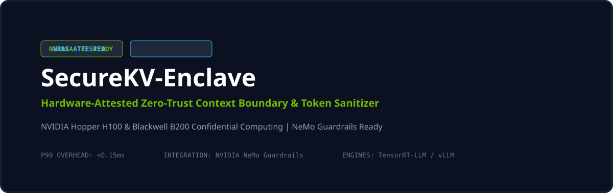

# SecureKV-Enclave

**Hardware-Attested Zero-Trust Context Boundary & Semantic Token Sanitizer for Confidential Hardware TEE Confidential Computing and NeMo Guardrails**

---

## Overview

SecureKV-Enclave is an ultra-low latency (<0.15ms) zero-trust context boundary sidecar proxy. It combines **hardware-level remote attestation verification (Confidential Hardware TEE)** with **cryptographic token pseudonymization** and **semantic multi-turn token budgeting**.

Raw enterprise identifiers never enter model weights or persistent KV caches in plaintext, yet the client receives an uninterrupted, deterministically re-hydrated response stream.

---

## Key Pillars

* **Hardware-Attested Context Boundary (NRAS)**: Validates that requests only unseal into verified Trusted Execution Environments (TEEs) running on Confidential Hardware TEE Hopper (H100) or Blackwell (B200) architectures.
* **Deterministic Token-Level Cryptographic Masking**: Replaces sensitive tokens with zero-entropy cryptographic surrogates before execution and deterministically re-hydrates responses at the client boundary.
* **Semantic Token Budget Reclamation**: Intercepts multi-turn conversational bloat, pruning historical redundant context to save 30%–50% on inference token costs without semantic quality loss.
* **Sub-Millisecond Overhead**: Designed with high-throughput streaming in mind, adding <0.15ms latency overhead per turn.
* **Confidential Hardware TEE Drop-in**: Ready-to-use custom action provider for Confidential Hardware TEE Guardrails pipelines.

---

## Quickstart

### 1. Installation

### 2. Run the Gateway Server

### 3. Run Latency Benchmarks

---

## License

Licensed under the Apache 2.0 License.
